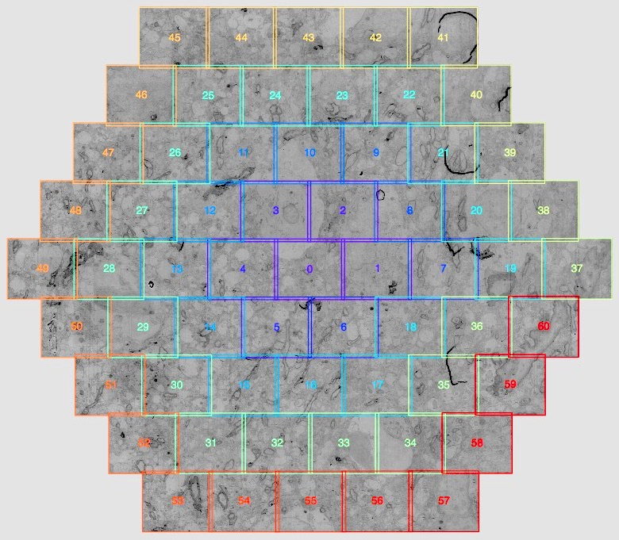

# Multibeam

This repository contains the source code to play around with ZEISS multibeam data.
At the current state it is mostly for testing ideas.

## Get started

### Source code

Clone 'multibeam' from github and and change to the folder:

```bash
git clone http://github.com/tbullmann/multibeam/
cd multibeam
```
### Install requirements

Using conda to create an environment ```multibeam``` and install the requirements:
```bash
conda create -n multibeam python=2.7 pillow scipy h5py pyyaml scikit-image pandas pyramid
source activate multibeam
pip install tifffile
```

### Folders and data

Now make symlinks to the data:
``` bash
ln -s ~/iclound/data/mbeam data
ln -s ~/iclound/temp/mbeam temp
```

### PyCharm

Change project interpreter to ```multibeam``` environment.

## Notes

### Beam indices

There is a particular numbering of the tiles according to the numbering of the electron beams.


|Indices|Position|
|-------|--------|
|0..36|inner|
|37..41|upper left diagonal|
|41..45|top|
|45..49|upper right diagonal|
|49..53|lower right diagonal|
|53..57|bottom|
|57..60,37|lower left diagonal|

|Indices|Overlap with other hexagons|Others indices|
|-------|--------|-------|
|0..36|none| |
|37|mixed| |
|38, 39, 40|upper left only|52, 51, 50|
|41|mixed| |
|42, 43, 44|top only|56, 55, 54|
|45|mixed| |
|46, 47, 48|upper right only| 60, 59, 58|
|49|mixed| |
|50, 51, 52|lower right only| 40, 39, 38
|53|mixed| |
|54, 55, 56|bottom only|44, 43, 42|
|57|mixed| |
|58, 59, 60|lower left only|48, 47, 46|